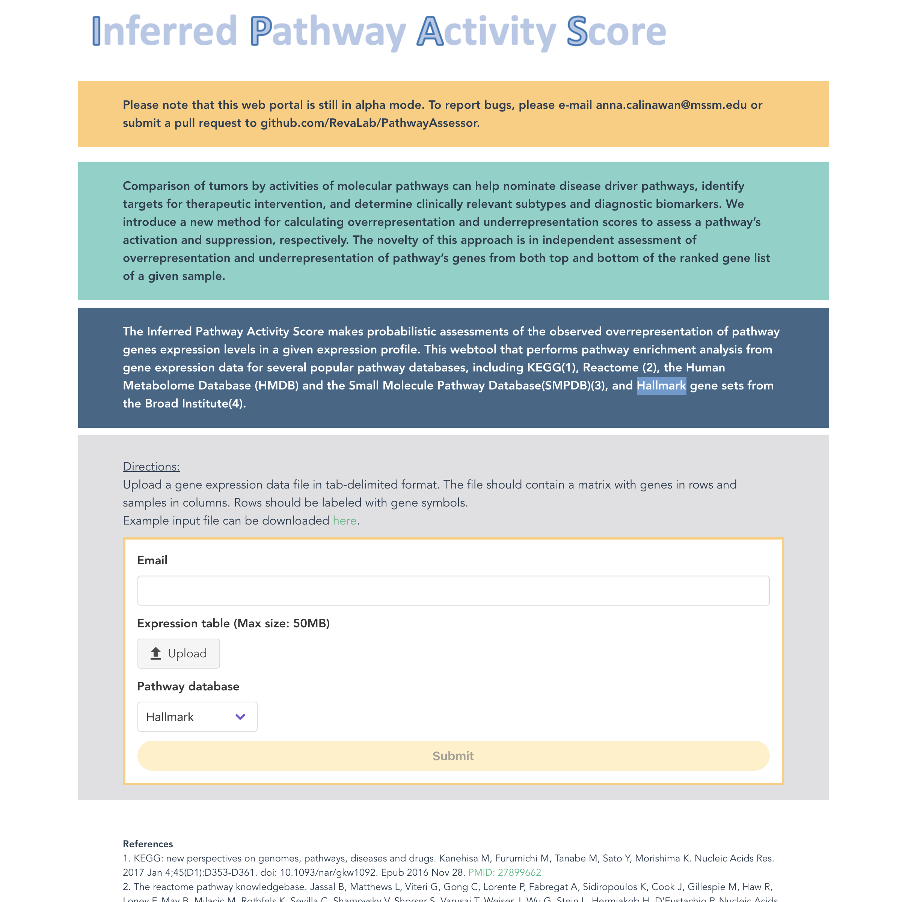

# pathway-assessor

Source code for the PathwayAssessor web application. 

Visit the application at: https://calina01.u.hpc.mssm.edu/pathway_assessor/



## Project setup
```
yarn install
```

### Compiles and hot-reloads for development
```
yarn serve
```

### Compiles and minifies for production
```
yarn build
```

### Customize configuration
See [Configuration Reference](https://cli.vuejs.org/config/).
